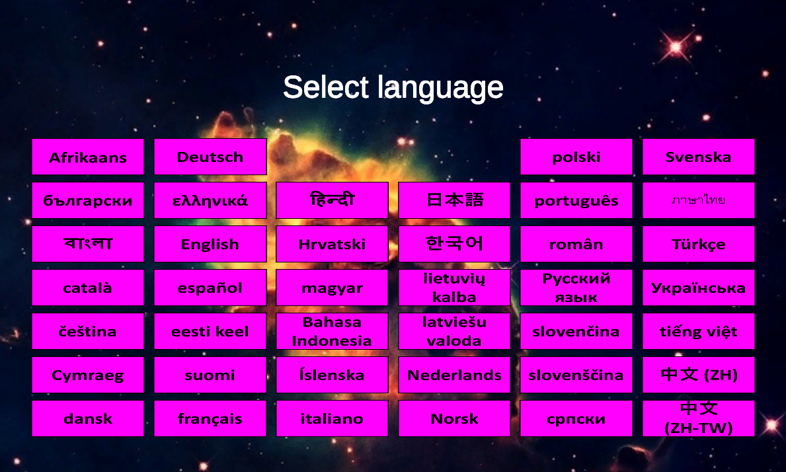
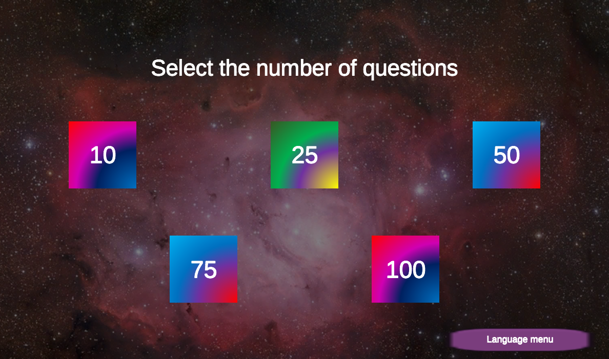
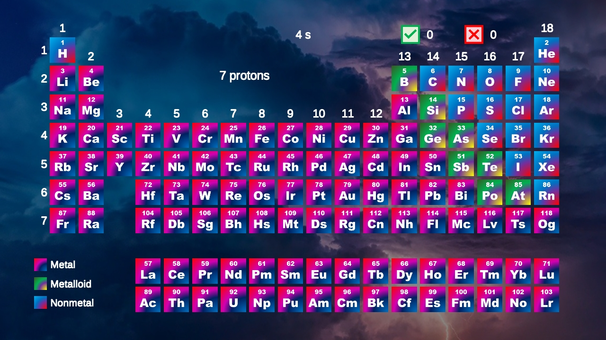
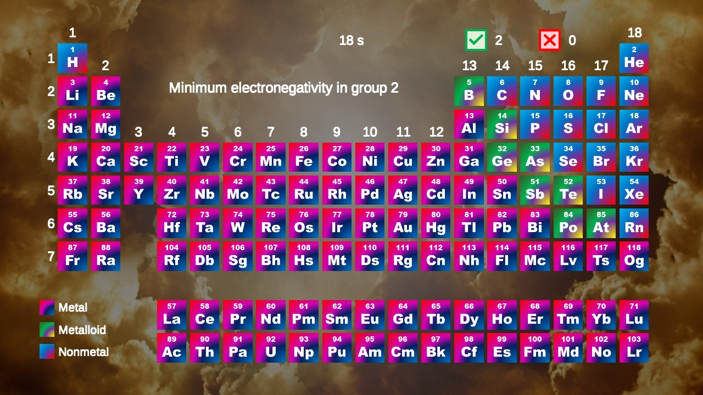
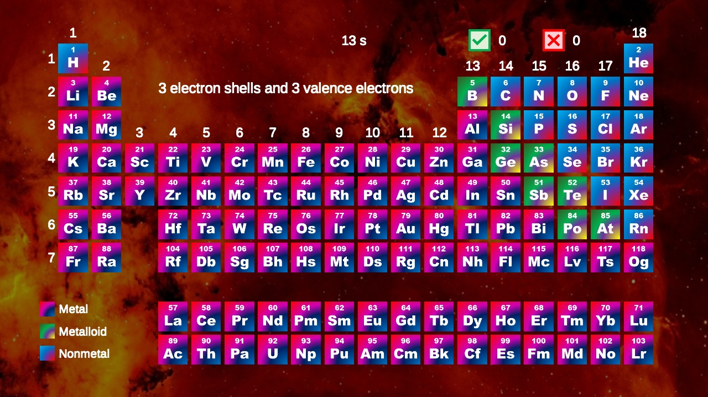
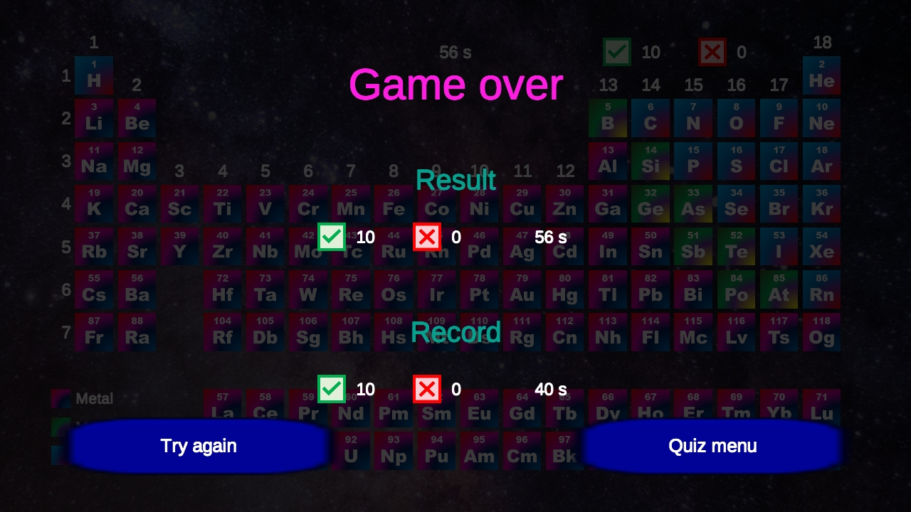

# Periodic Table

Welcome to Periodic Table, a fun and educational web-based chemistry learning game! This game is designed for anyone looking to deepen their understanding of the periodic table and its secrets.

The objective of the game is to find the element that corresponds to a given description from the periodic table. You will receive various hints related to the groups, periods, and atomic numbers of elements, as well as periodic properties such as atomic radius and electronegativity. The challenge is to identify the correct element based on its description.

You can choose the length of the game and play at your own pace. Periodic Table is available in 40 different languages, allowing you to learn the fundamentals of chemistry in your native language or try out new languages for an added challenge!

